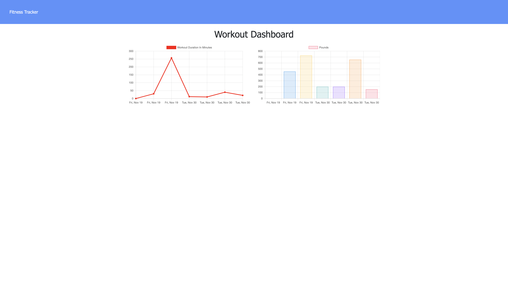

# workoutTracker

Hello! This repo is an exercise completed for the U of MN fullstack web dev bootcamp. 

Given some starter html and javascript, this assignment required setting up an express server,  MongoDB database, and Mongoose models in order to properly display workout data on the website. 

[Visit the deployed site here!]( )

Author: [@Brendan838](https://github.com/Brendan838)

----------------------------------------------------------------------

